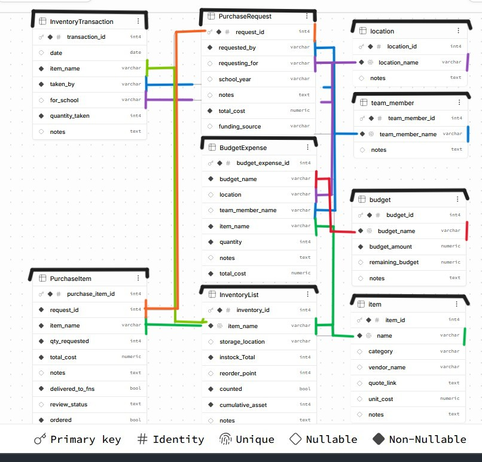

# LCSD garden program database
This is a database project for the Lee County School District garden program that focuses on creating a more organized and centralized way to manage garden-related data. The project is based on the program’s current use of Google Sheets and will support areas such as inventory and supplies, garden sizes and components, and growing calendars and crop rotations. The goal is to improve how information is stored, connected, and accessed so staff can better track available resources, locations, distribution, budgets, and other garden program data over time.

## Current Inventory Database Schema

The current ERD for the inventory portion of the database is shown below.

                         ┌──────────────┐
                         │ team_member  │
                         └──────┬───────┘
                     ┌──────────┼─────────────┐
                     ▼          ▼             ▼
              PurchaseRequest BudgetExpense InventoryTransaction
                     │          ▲             ▲
                     │          │             │
                     ▼          │             │
               PurchaseItem     │             │
                     ▲          │             │
                     │          │             │
                   item ────────┘             │
                     │                        │
                     ▼                        │
               InventoryList ─────────────────┘
