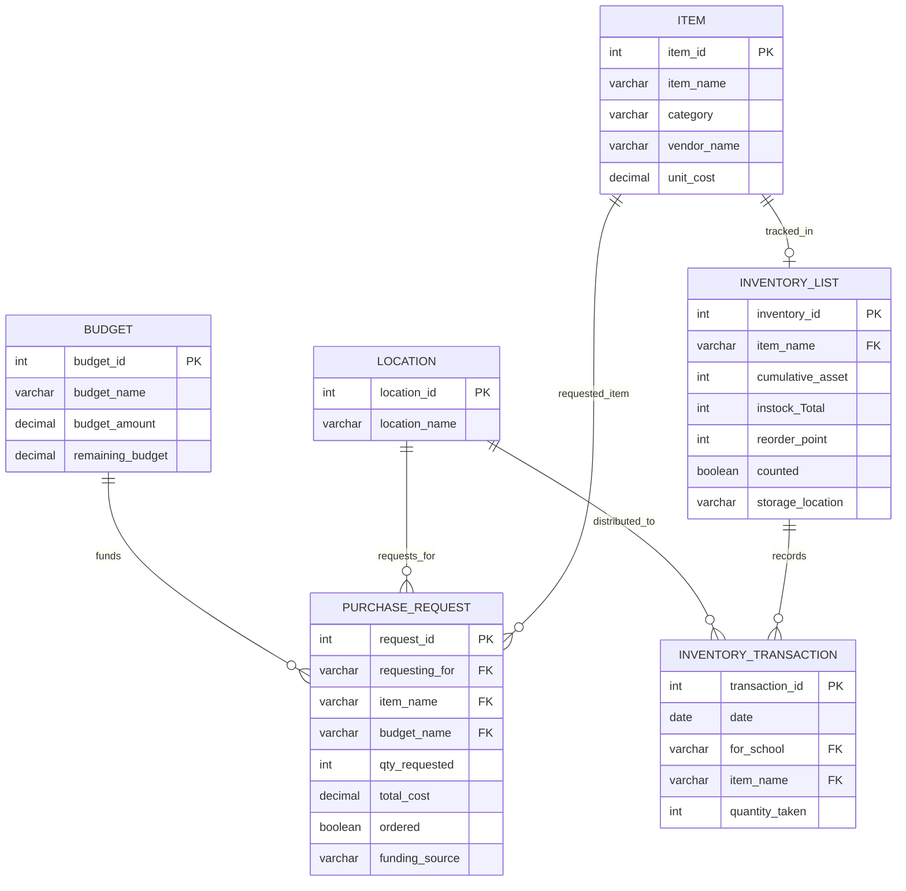

# LCSD Garden Program Database

This is a database project for the Lee County School District garden program that focuses on creating a more organized and centralized way to manage garden-related data. The project is based on the program's current use of Google Sheets and will support areas such as inventory and supplies, garden sizes and components, and growing calendars and crop rotations.

The goal is to improve how information is stored, connected, and accessed so staff can better track available resources, locations, distribution, budgets, and other garden program data over time.

# What We Need to Work On

### Inventory & Supplies

Monitor seed stocks, tools, soil, and equipment across all campuses to avoid duplicate purchasing, prevent shortages, and allocate budgets effectively. The program currently has a rudimentary system for inventory management, supply requests, distribution of supplies, and restocking inventory. However, this could use some refinement.

### Garden Sizes & Components

Maintain up-to-date records of physical garden footprints, irrigation setups, composting units, and active bed counts for each school site.

### Growing Calendars & Crop Rotations

Plan planting schedules, manage crop rotations to maintain soil health, and track seasonal variations systematically while ensuring resources are prepared for the various growing cycles.

# IMPLEMENTATION
The inventory & Supply + Budget is in the inventory schema
The Garden Sizes & Components + Growing Calendars & Crop Rotations tables are all in the garden schema

# Current Inventory Database Schema

The current database schema focuses on the inventory portion of the project.

> Authentication and user tracking are planned for a future stage of the project and are not currently part of the inventory schema.
